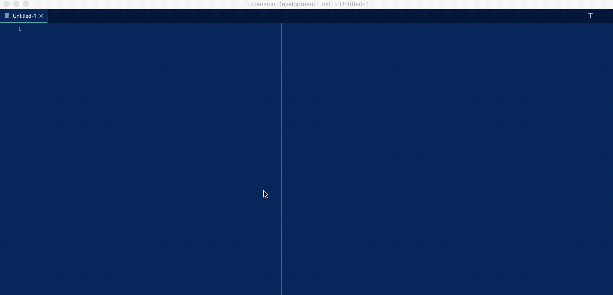

# Statamic Docs

Easily access Statamic documentation pages from within Visual Studio Code

## Features

To use this extension, simply use `⌘ + Shift + P` to open the command palette (`Ctrl` on windows / linux) and search for "Statamic" or the specific docs topic you're after. That's it!

Here's an example:    

## Release Notes

### 1.0.0

Initial release -- Statamic 3 Beta support
